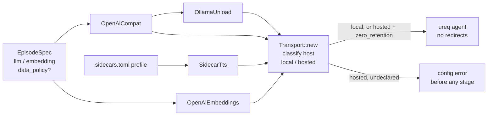

> **Human reference.** The loop never reads this file. What it enforces lives in
> [`privacy.rules.md`](./privacy.rules.md); if the two disagree, the rules file wins
> and `/architect --update privacy` should be run.

# Privacy architecture
_Last verified: 2026-10-07 at `4a1f3af` · Source idea: [story-driven-script](../ideas/story-driven-script.md)_

## In plain English
Nothing Podling processes may end up training anyone's model. That covers
sources, scripts and, later, the work authors submit. The machinery is:
- **Local by default.** Every HTTP provider (LLM, embeddings, the Ollama
  unload call, the TTS sidecar) goes through one constructor, `Transport::new`.
  It refuses any endpoint that isn't on this machine or a private network,
  before any stage runs.
- **Opting in to a hosted endpoint.** A hosted endpoint is allowed only when
  its section says `data_policy = "zero_retention"`: the operator's statement
  that the host neither trains on nor keeps what it is sent (e.g. Together AI
  with zero data retention switched on). The declaration is logged, is part of
  the provider's fingerprint, and lands in `out/episode.json` with the endpoint,
  so every run records where its text went.
- **Already local.** The voice model, Whisper and the NLI model run on this
  machine (`README.md:313`).

## How it fits

## Decisions
| id | decision | why | rejected alternatives |
|---|---|---|---|
| ARCH-PRIVACY-01 | Local = localhost, loopback and private IP literals (user's choice) | Covers this machine and a home server. A hostname can't prove where DNS sends it | Loopback only (a home server would need a false "hosted" declaration) |
| ARCH-PRIVACY-02 | Enforced in `Transport::new`, local by default (user's choice) | The single constructor every HTTP provider uses (`openai.rs:69`, `openai_embeddings.rs:61`, `ollama.rs:43`, `sidecar_tts.rs:155`), so a new provider can't bypass it. Fails before the LLM spends time | Allow by default with an opt-in `local_only`; a pipeline-level check (a new provider could miss it) |
| ARCH-PRIVACY-03/05 | `data_policy = "zero_retention"` on `[llm]` / `[embedding]` (user's choice) | One field with one meaning, recorded and fingerprinted | Raw `extra_body` passthrough (no guarantee); one provider kind per host |
| ARCH-PRIVACY-04 | Unload inherits `[llm]`'s policy; the sidecar gets none | Unload talks to the same server; a remote TTS sidecar would receive the script | Separate declarations |
| ARCH-PRIVACY-06 | Keep no-redirects and no-credentials-in-URL | Without them a local server could bounce text to a hosted one | — |
| ARCH-PRIVACY-07 | Info log per transport | The run log shows where text goes | — |
| ARCH-PRIVACY-08 | Translate the declaration for known hosts | OpenRouter's `provider.data_collection` / `zdr` (https://openrouter.ai/docs/guides/routing/provider-selection) can enforce what the field declares, without a second field | A per-host field |

## Data & flows
- **Hosted providers and their training terms** (as of 2026-10-07; re-check before sending authors' text):
  - **Together AI.** No training without consent. Zero data retention is an organisation setting. https://docs.together.ai/docs/zero-data-retention
  - **DeepSeek's own API.** Trains by default and is excluded. https://cdn.deepseek.com/policies/en-US/deepseek-terms-of-use.html
  - **Free tiers.** May train on prompts; excluded.
- **What `data_policy` is and isn't.** It is an attestation, not a proof: Podling cannot see the host's settings. What Podling guarantees is that no text leaves this machine or network unless someone declared it in the episode file.

## Trade-offs & known limits
- **A breaking change for undeclared hosted configs.** No example uses one today.
- **Authors' submissions** will need per-source or per-episode "local only, whatever the config" marking. That is left to the fiction/author idea. The default here already makes local the norm.
- **Private ranges.** Private IP ranges also cover networks the user doesn't own (e.g. a corporate LAN).

## Glossary
- **Zero data retention (ZDR):** the host stores neither prompts nor outputs.
- **Hosted:** any endpoint outside loopback and private IP ranges.
- **Attestation:** the operator's declaration in the episode file.
