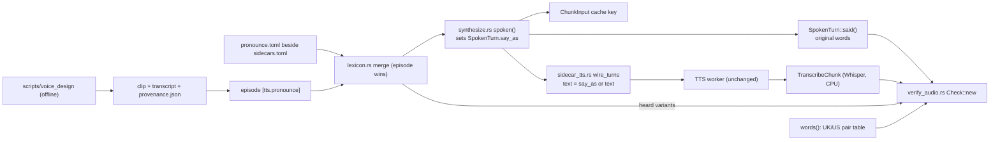

> **Human reference.** The loop never reads this file. What it enforces lives in
> [`speech.rules.md`](./speech.rules.md); if the two disagree, the rules file wins
> and `/architect --update speech` should be run.

# Speech architecture
_Last verified: 2026-10-07 at `2d21606` · Source idea: [natural-episode-speech](../ideas/natural-episode-speech.md)_

## In plain English
Podling turns a script into audio by sending each chunk of turns to a TTS worker (Qwen3-TTS 1.7B Base), then checks the audio by transcribing it with Whisper and comparing the words.

This area covers three fixes for how episodes sound:
- **Names.** You can respell names the model says wrongly ("Kulik" → "Koolick"). The respelling goes to the model only. The check and the quotes still use the real spelling.
- **Spellings.** The check stops counting "kilometres" vs Whisper's "kilometers" as an error.
- **Voices.** You can design your own voices offline with Qwen3-TTS VoiceDesign, as long as each clip records where it came from.

The word test (docs/ideas/natural-episode-speech.md, "Word test") showed respelling helps names but hurts common words. So the lexicon is for names, not a general text normaliser.

## How it fits

## Decisions
| id | decision | why | rejected alternatives |
|---|---|---|---|
| ARCH-SPEECH-01/02 | Respelling lives in `SpokenTurn.say_as`, swapped in only on the wire | Only chunks that contain a listed name get a new cache key; the check keeps the real words | Overwrite `text` (breaks the check and quotes); put the whole lexicon in the chunk key (any edit re-synthesises every chunk); apply in the Python adapter (needs a protocol change and an `ADAPTER_VERSION` bump) |
| ARCH-SPEECH-03 | Worker protocol and adapter unchanged | Rust owns the text; the worker stays a dumb speaker | Lexicon field in the protocol |
| ARCH-SPEECH-05 | Whole-word, case-sensitive, longest first, turn text only | Names are proper nouns; the word test showed respelling common words makes them worse | Case-insensitive or substring matching |
| ARCH-SPEECH-06/07 | User-level lexicon plus `[tts.pronounce]`, episode wins (user's choice) | Common names are written once; an episode can still override | Episode only (repetitive); user file only (the episode no longer says how it sounds) |
| ARCH-SPEECH-08/09 | Optional `heard` list per name, applied to the transcript only | Whisper writes respelt names unpredictably; the plain `Name = "say"` form stays short | Treat the respelling as correct (only works when Whisper writes the respelling exactly); rely on the WER threshold |
| ARCH-SPEECH-10 | Built-in British/American word-pair table | No false matches, no dependency, grows when misses show up | Suffix rules (mangle `acre`, `genre`, `premise`); rules plus list |
| ARCH-SPEECH-11 | No stage version bumps | Keys already change exactly where output changes; the check isn't cached | Bumping (needlessly re-synthesises every episode) |
| ARCH-SPEECH-13/14/15 | `LicenseRef-Podling-Generated` plus a required provenance file, made by an offline design script (user's choice) | Self-designed voices have no CC source; SPDX `LicenseRef-` keeps the manifest valid; provenance records model, prompt and seed | Defer the tool until the voice marketplace; record generated clips as CC0 |
| ARCH-SPEECH-16 | *Superseded by [ARCH-STORY-02](./story.md):* script-prompt changes now bump `SCRIPT_PROMPT_VERSION`, so they no longer re-run claim extraction | Bump rules | — |
| ARCH-SPEECH-17 | No model swap here | A swap needs its own VRAM-gated spike | Switch to an instruction-capable model now |

## Data & flows
- **Lexicon:** owned by the user (user-level file) and the episode (`[tts.pronounce]`). It is merged once per run, and the episode wins per name. Changing a name's `say` re-synthesises only the chunks that contain that name (plus the next chunk, for a backend that listens to context; none does today). Changing `heard` only changes the check, which runs again on every run anyway.
- **Transcripts:** keyed on the expected (original) text, so adding a respelling re-transcribes only the chunks whose audio changed.
- **Generated voices:** the design script writes `<name>.wav`, `<name>.txt` (transcript) and `<name>.wav.provenance.json`. Podling refuses a generated-licence voice that has no valid provenance file (checked in `Voices::resolve`, before any stage), and copies the licence into the audio manifest as it does today.

## Trade-offs & known limits
- **Flat delivery stays mostly unsolved.** The Base model takes no style instruction. The levers are expressive designed voices and less repetitive scripts. A model swap is deferred.
- **The user-level lexicon makes output depend on a file outside the episode.** The cache key still captures the effect through `say_as`, but sharing an episode doesn't share that file.
- **The spelling table only catches pairs someone has listed.** Unknown pairs show up as WER until they're added.
- **Commercial use of generated voices assumes the VoiceDesign weights are Apache-2.0.** The dependency audit of `scripts/voice_design/` found no AGPL, non-commercial or revenue-capped package (`scripts/voice_design/README.md`). The voice-marketplace licensing idea may later replace `LicenseRef-Podling-Generated`.

## Glossary
- **Lexicon:** name → respelling (and optional heard-as variants).
- **say_as:** the model-facing text of a turn after respelling.
- **Heard variant:** a spelling Whisper may produce for a name, counted as the name.
- **Provenance file:** JSON beside a generated clip naming the model, weights commit, prompt, seed and tool version.
