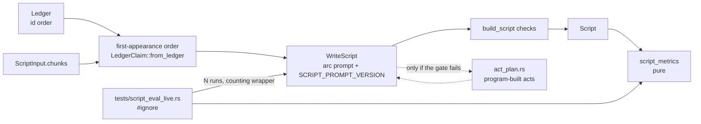

> **Human reference.** The loop never reads this file. What it enforces lives in
> [`story.rules.md`](./story.rules.md); if the two disagree, the rules file wins
> and `/architect --update story` should be run.

# Story architecture
_Last verified: 2026-10-07 at `4a1f3af` · Source idea: [story-driven-script](../ideas/story-driven-script.md)_

## In plain English
The script stage turns the claim ledger into a two-host episode. Until now it
was asked to cover every usable claim. It got the claims in hash order
(`Ledger` sorts by claim id), so what came back was a walk through the facts,
not a story.

This area makes the script tell a story without loosening any grounding rule:
- Claims reach the model in the order the sources first mention them.
- The prompt asks for a story shape: cold open, one through-line from `topic`,
  anecdote then reflection, the disputed fact as the turning point, and a
  closing reflection.
- The episode's angle is simply its `topic`.

Every change is measured. A pure metrics function scores each script, and an
ignored live test runs the script stage several times against a saved run and
prints the table. If the story-shaped prompt alone can't reach the target
length or keep citations valid on the local model, the next step is an act
writer whose plan is built by the program, not the LLM. Its rules are fixed
here in advance.

## How it fits

## Decisions
| id | decision | why | rejected alternatives |
|---|---|---|---|
| ARCH-STORY-01 | Claims in first-appearance order, request view only | Sources tell events in roughly narrative order; hash order hides it. The persisted ledger stays unchanged | Re-sort the `Ledger` artifact (moves every downstream key); order by embedding relevance to `topic` (embeddings are optional and released before the script, `pipeline.rs:197`) |
| ARCH-STORY-02 | Separate `SCRIPT_PROMPT_VERSION` (user's choice; supersedes ARCH-SPEECH-16) | Story-prompt iteration must not re-run claim extraction, which shares `PROMPT_VERSION` (`extract_claims.rs:98`). Same precedent as `ADJUDICATE_PROMPT_VERSION` | Keep the shared version (every tweak re-extracts and may change the ledger mid-comparison) |
| ARCH-STORY-03 | Stage and fake versions bump with logic | Bump rules 2 and 3 | — |
| ARCH-STORY-04 | Arc prompt, rules 1–5 untouched | Radio narrative non-fiction alternates anecdote and reflection (https://hindenburg.com/blog/understanding-story-structure/); the disputed fact is a natural turning point but must stay a dispute | Rewrite the rules wholesale; drop the judged-Contested check |
| ARCH-STORY-05 | `topic` is the angle | `topic` already steers ("how the 1912 Titanic inquiries disagreed"); a field is added only on evidence | A `focus` field now |
| ARCH-STORY-06/07 | Pure metrics + ignored live test (user's choice) | Same shape as the stance-precision evaluation; no user-facing surface; the cache is bypassed so N runs are N samples | CLI `eval-script` subcommand; a Python driver (CLAUDE.md keeps Python to sidecars) |
| ARCH-STORY-08 | Act writer gated on measurement (user's choice) | The idea's evidence was weak (one listener, one 10-minute run); build only what the numbers ask for | Build the act writer now |
| ARCH-STORY-09/10 | If built: program-built act plan, one call per act, one whole-script check (user's choice) | An 8B model writes ~300 words reliably, not 1,500; the LLM never produces claim ids (the Titanic failure mode); the existing checks stay the single gate | An LLM outline validated against the ledger; decide later |
| ARCH-STORY-11 | Debug claim order, info word ratio | Makes the before/after visible in ordinary runs | — |

## Data & flows
- **Order** is derived per request from `ScriptInput.chunks` (document order) and each claim's evidence chunks. No artifact stores it.
- **Gate.**
  1. Record a baseline: today's prompt, llama3.1:8b, 5 runs each on Titanic and Tunguska.
  2. Run the arc prompt the same way.
  3. The act writer is planned only if the arc prompt's mean word ratio is below 0.70, or its eventual pass rate is below baseline, or it has more unknown-citation rejections than baseline.
- **Hosted comparison.** The same harness against Together AI (zero retention on), declared under [privacy](./privacy.md). It shows whether a shortfall is the model or the prompt.

## Trade-offs & known limits
- **Order is a heuristic.** First appearance is not always chronological (a report may open with its conclusion). Revisit if listening shows confused timelines.
- **`MAX_SCRIPT_TOKENS` is still 8,192 per call** (`script.rs:219`). A 30–60-minute episode in one call is impossible, so long episodes depend on the act writer.
- **Thin evidence.** Metrics measure length and grounding, not brilliance. The blind listen stays the judge of quality (LLM judges don't track expert judgment: https://arxiv.org/abs/2309.14556).

## Glossary
- **First-appearance order:** a claim's position is the earliest source chunk that supports it.
- **Word ratio:** script words divided by 150 × `target_minutes`.
- **Turning-point act:** the act before the closing act, which carries the judged Contested claims.
- **Gate:** the measured condition that decides whether the act writer gets built.
